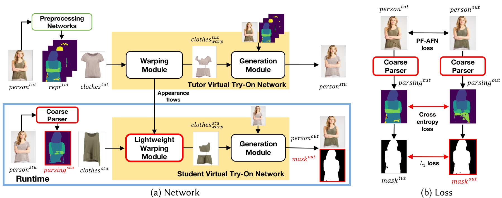

# DIVTON: Virtual try-on model of MIRROR




## Environment
```
conda create -n vto python=3.8

conda install pytorch==1.12.1 torchvision==0.13.1 torchaudio==0.12.1 cudatoolkit=11.3 -c pytorch
pip install cupy-cuda113
pip install opencv-python tensorboardX
pip install onnx
```

## Train
1. Move to "train" folder.
2. Download the VITON training set from [VITON_train](https://drive.google.com/file/d/1Uc0DTTkSfCPXDhd4CMx2TQlzlC6bDolK/view?usp=sharing) and put the folder "VITON_traindata" under the folder "dataset". Also, download [human parsing results of dataset](https://drive.google.com/file/d/1BLyuG51ByOFvMgR4eJTAaZYqI4biKZu_/view?usp=sharing) and put the folder under folder "VITON_traindata"
3. Download [human parsing model](https://drive.google.com/file/d/1E5YwNKW2VOEayK9mWCS3Kpsxf-3z04ZE/view?usp=sharing) and put checkpoint under the folder "checkpoints".
4. First train the tutor network. Run **scripts/pb_s1.sh**. After training the warping module, run **scripts/pb_e2e.sh**.
5. After training the tutor network, train the student network. Run **scripts/pf_s1_pascal.sh**. After training the warping module, run **scripts/pf_e2e_pascal.sh**.


## Test
1. Move to "test" folder.
2. First, you need to download checkpoints of [warping module](https://drive.google.com/file/d/1JRQgnV0Xce97utEmwrRr3gcZJOaKJ7c4/view?usp=drive_link), [generation module](https://drive.google.com/file/d/1Ve_p__HWVBN93eWbyw4YXFbcFcGy-A59/view?usp=sharing) and [parsing model](https://drive.google.com/file/d/1E5YwNKW2VOEayK9mWCS3Kpsxf-3z04ZE/view?usp=sharing) and put checkpoints under the folder "checkpoints".
3. Download the VITON test set from [VITON_test](https://drive.google.com/file/d/1Y7uV0gomwWyxCvvH8TIbY7D9cTAUy6om/view?usp=sharing) and put the folder "VITON_test" under the folder "dataset".
4. To test with the saved model, run **test.sh** and the results will be saved in the folder "results".


## Export ONNX
1. Move to "export_onnx" folder.
2. Place checkpoints of [warping module](https://drive.google.com/file/d/1JRQgnV0Xce97utEmwrRr3gcZJOaKJ7c4/view?usp=drive_link), [generation module](https://drive.google.com/file/d/1Ve_p__HWVBN93eWbyw4YXFbcFcGy-A59/view?usp=sharing) and [parsing model](https://drive.google.com/file/d/1E5YwNKW2VOEayK9mWCS3Kpsxf-3z04ZE/view?usp=sharing) under folder "torch_checkpoints".
3. Export each model using following script.

```
python warp_export_onnx.py
python gen_export_onnx.py
python parsing_export_onnx.py
```
4. Build onnxruntime to convert onnx checkpoints to ort with nnapi support.
```
conda install cmake

git clone --depth 1 --branch v1.10.0 https://github.com/microsoft/onnxruntime.git

python ./tools/ci_build/build.py --build_dir ./build/Windows --config RelWithDebInfo --use_nnapi --build_shared_lib --build_wheel --parallel --skip_test
```

5. Convert onnx checkpoints to ort.
```
python -m onnxruntime.tools.convert_onnx_models_to_ort --use_nnapi --optimization_level basic onnx_checkpoints/warp.onnx
python -m onnxruntime.tools.convert_onnx_models_to_ort --use_nnapi --optimization_level basic onnx_checkpoints/gen.onnx
python -m onnxruntime.tools.convert_onnx_models_to_ort --use_nnapi --optimization_level basic onnx_checkpoints/parsing.onnx
```

