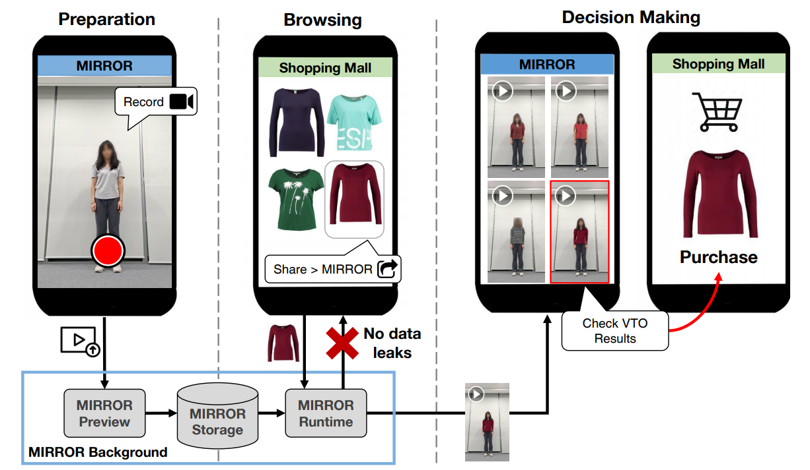

# MIRROR: Towards Generalizable On-Device Video Virtual Try-On for Mobile Shopping

Official code for "MIRROR: Towards Generalizable On-Device Video Virtual Try-On for Mobile Shopping", IMWUT 2023 / Ubicomp 2024.

[[Paper]](https://dl.acm.org/doi/abs/10.1145/3631420)

<div align="center">
  <br><br>
</div>

# License
The use of this software is RESTRICTED to non-commercial research and educational purposes.

## Contributor
[Dong-Sig Kang](https://github.com/Ds-Kang), [Dongha Ahn](https://github.com/2019dahn)

## Citation
``` 
@article{kang2024mirror,
  title={MIRROR: Towards Generalizable On-Device Video Virtual Try-On for Mobile Shopping},
  author={Kang, Dong-Sig and Baek, Eunsu and Son, Sungwook and Lee, Youngki and Gong, Taesik and Kim, Hyung-Sin},
  journal={Proceedings of the ACM on Interactive, Mobile, Wearable and Ubiquitous Technologies},
  volume={7},
  number={4},
  pages={1--27},
  year={2024},
  publisher={ACM New York, NY, USA}
}
```